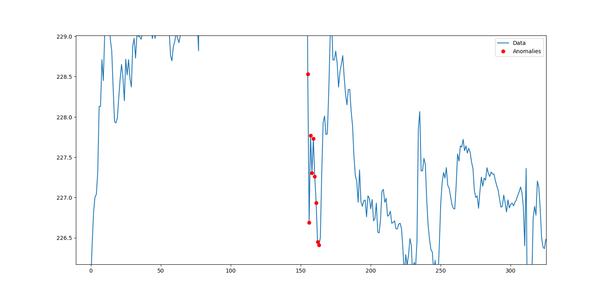

# Efficient Data Stream Anomaly Detection using `yfinance` API

## Description
This project implements an efficient anomaly detection system for real-time financial data streams using an LSTM-based autoencoder. The system retrieves data from the `yfinance` API for selected stock symbols and detects anomalies in price movements.

## Setup
1. Clone the repository:
    ```bash
    git clone <repo_url>
    cd anomaly_detection
    ```

2. Install dependencies:
    ```bash
    pip install -r requirements.txt
    ```

3. Run the anomaly detection:
    ```bash
    python run_detection.py
    ```

## Files
- **`src/data_stream.py`**: Retrieves financial data using `yfinance` and processes it into a data stream  (e.g., "AAPL" for Apple) .
- **`src/model.py`**: Contains the LSTM model architecture :
 This code builds and trains an LSTM autoencoder, which learns to reconstruct time series data. During training, it learns the typical patterns in the data.
- **`src/detect_anomalies.py`**: Implements anomaly detection logic:
The logic behind the anomaly detection method in your code relies on the reconstruction error from an autoencoder model. Here's how it works:

1. Model Prediction:
The autoencoder model is trained to compress and then reconstruct the input data as accurately as possible.
During anomaly detection, the model predicts the reconstructed version of the input data.

2. Reconstruction Error:
The mean squared error (MSE) between the actual input data and its reconstruction is calculated. This error represents how well the model was able to reconstruct the data:
python
Copy code
mse = np.mean(np.power(data - predictions, 2), axis=(1, 2))
For normal (non-anomalous) data, the reconstruction error will typically be low, because the model has learned to recreate these types of inputs.
For anomalous data, the model will have a higher reconstruction error, because it has not seen this kind of data during training and struggles to accurately reconstruct it.

3. Thresholding:
To decide if a data point is an anomaly, the reconstruction error is compared to a predefined threshold. If the error is larger than this threshold, the point is classified as an anomaly:
python
Copy code
anomalies = mse > threshold
4. Threshold Calculation:
The threshold is dynamically calculated based on the training data by taking the MSE values from the training phase and setting the threshold to a high percentile (e.g., 95th percentile):
python
Copy code
threshold = np.percentile(mse, percentile)
This ensures that only the top 5% of errors (assuming a 95th percentile) are classified as anomalies.


- **`src/visualize.py`**: Handles real-time data visualization: 
The code trains an LSTM autoencoder on normal data (mock sine wave) and detects anomalies in a live data stream. It visualizes the stream in real time, with anomalies highlighted as red points on the plot.


## Requirements
- Python 3.x
- The required libraries are listed in `requirements.txt`.


